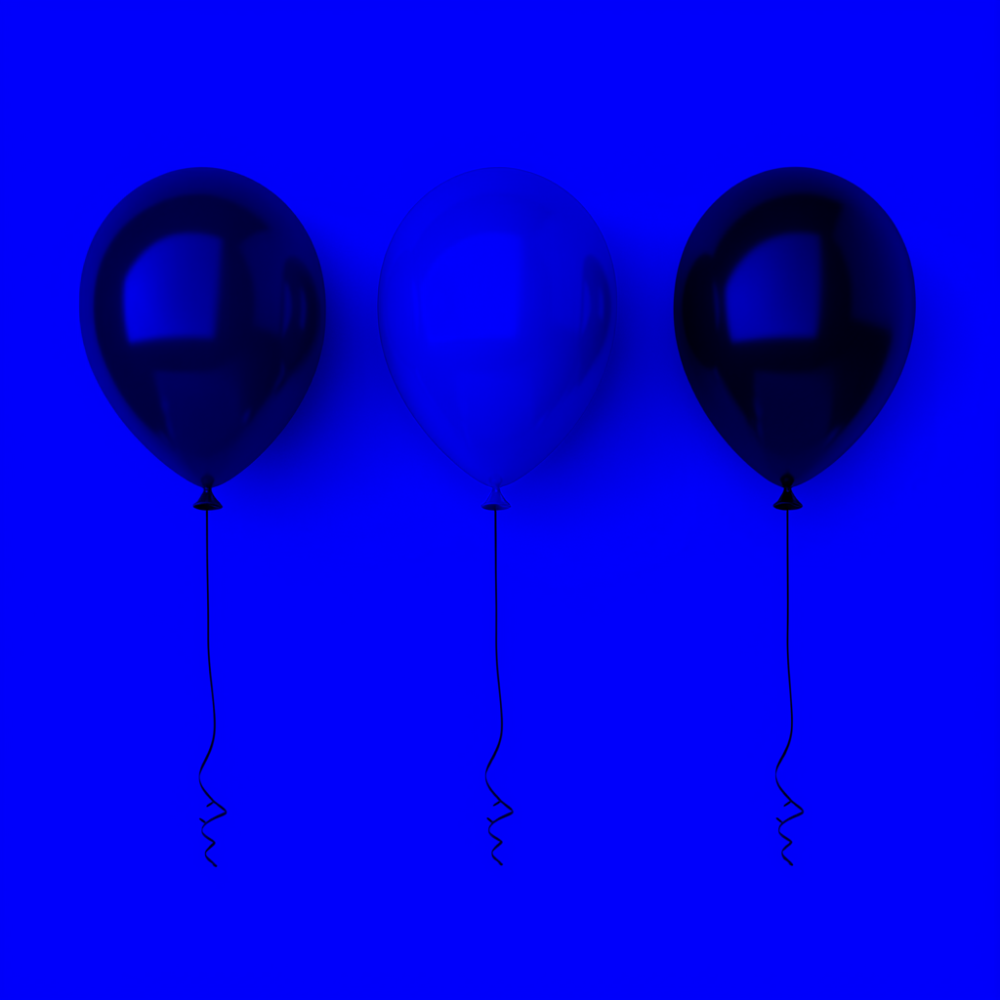
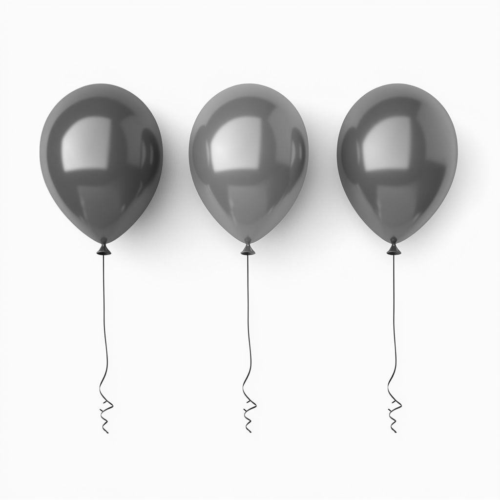
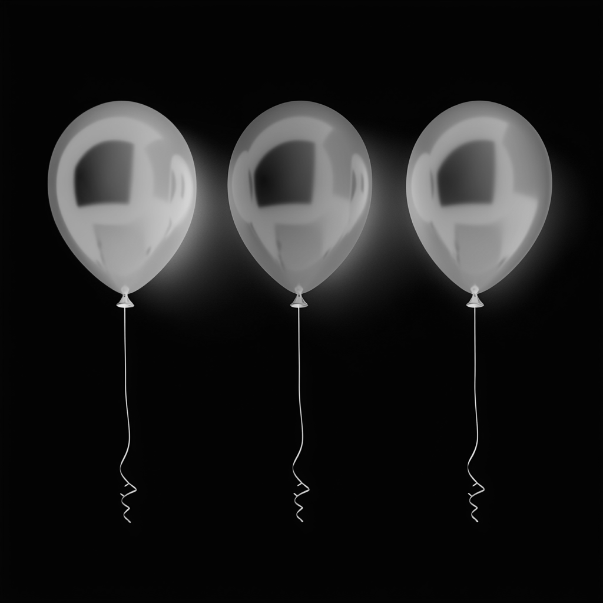

# Отчет по лабораторной работе №1

## 1. Выделение компонент R, G, B
Были разделены каналы изображения. Ниже представлены результаты:
- Канал R: 
- Канал G: 
- Канал B: 

## 2. Преобразование изображения в HSI
Ниже представлены компоненты:
- Яркостная компонента: 
- Инвертированная яркостная компонента: 

## 3. Изменение размера изображения

### 3.1 Изначальные размеры изображения
Размер изображения: (1024, 1024)

### 3.2 Растяжение (интерполяция)
Коэффициент растяжения: M = 3  
Результат растяжения:   
Размер изображения: (3072, 3072)

### 3.3 Сжатие (децимация)
Коэффициент сжатия: N = 2  
Результат сжатия:   
Размер изображения: (512, 512)

### 3.4 Передискретизация в два прохода (растяжение + сжатие)
Коэффициент: K = M / N = 1.5  
Результат передискретизации в два прохода:   
Размер изображения: (1536, 1536)

### 3.5 Передискретизация в один проход
Коэффициент: K = 1.5  
Результат передискретизации в один проход:   
Размер изображения: (682, 682)

