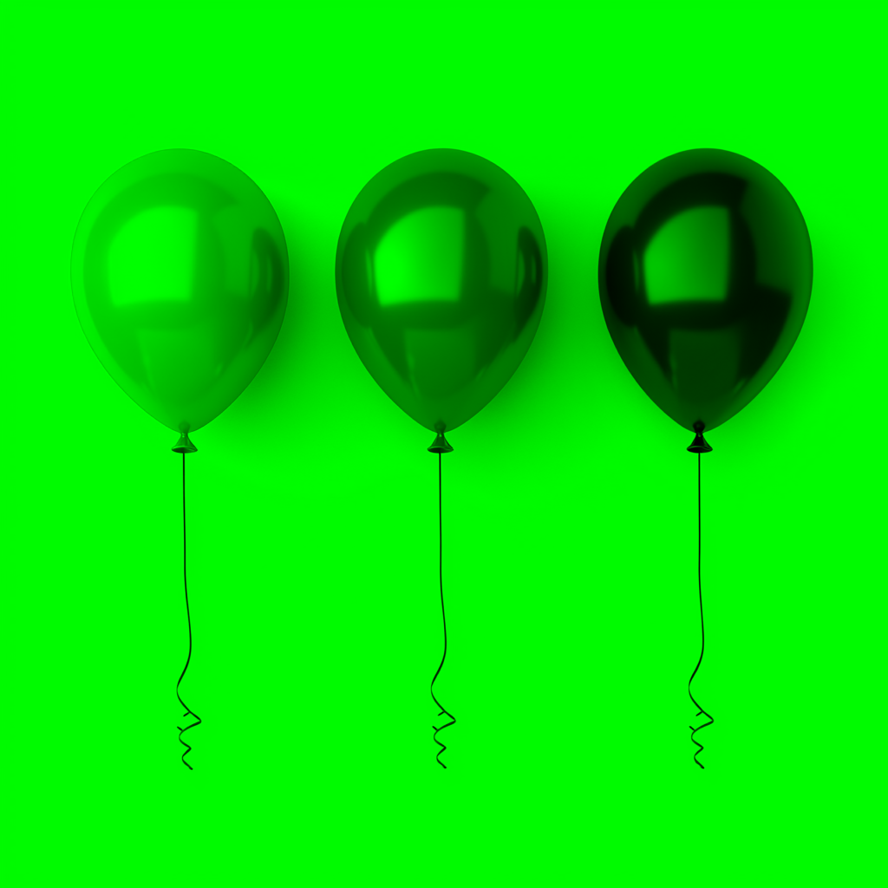
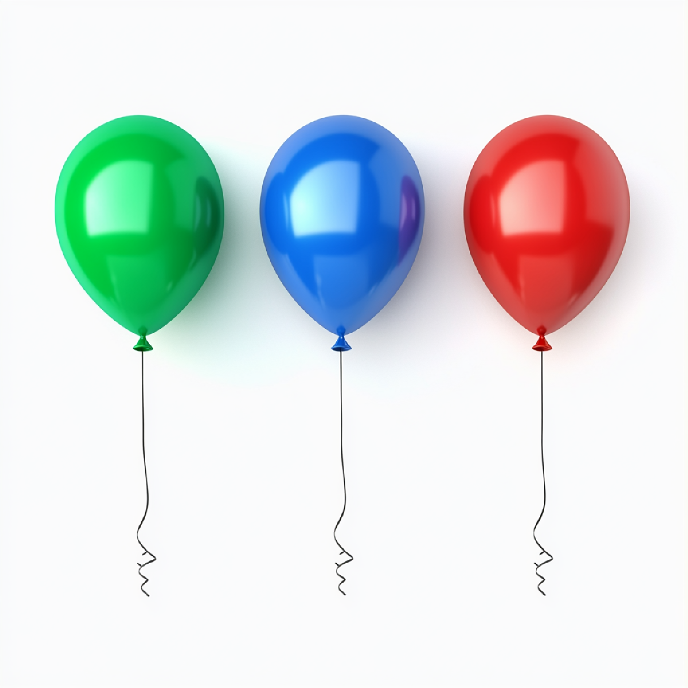

# Отчет по лабораторной работе №1

## 1. Выделение компонент R, G, B
Были разделены каналы изображения. Ниже представлены результаты:
- Канал R: 
- Канал G: 
- Канал B: 

## 2. Преобразование изображения в HSI
Ниже представлены компоненты:
- Яркостная компонента: 
- Инвертированная яркостная компонента: 

## 3. Изменение размера изображения

### 3.1 Изначальные размеры изображения
Размер изображения: (1024, 1024)

### 3.2 Растяжение (интерполяция)
Коэффициент растяжения: M = 3  
Результат растяжения:   
Размер изображения: (3072, 3072)

### 3.3 Сжатие (децимация)
Коэффициент сжатия: N = 2  
Результат сжатия:   
Размер изображения: (512, 512)

### 3.4 Передискретизация в два прохода (растяжение + сжатие)
Коэффициент: K = M / N = 1.5  
Результат передискретизации в два прохода:   
Размер изображения: (1536, 1536)

### 3.5 Передискретизация в один проход
Коэффициент: K = 1.5  
Результат передискретизации в один проход:   
Размер изображения: (682, 682)

# Лабораторная работа Nº2: Обесцвечивание и бинаризация растровых изображений

## Исходные изображения: 

## Этап 1: Приведение полноцветного изображения к полутоновому

  
Формула вычисления яркости каждого пикселя:
  Y = 0.3 · R + 0.59 · G + 0.11 · B

## Этап 2: Приведение полутонового изображения к монохромному методом пороговой обработки
- **Метод:** Адаптивная бинаризация WAN
- **Размер окна:** 5×5
- Порог вычисляется по формуле:
T = m_max * (1 - k * (1 - s/R))
m_max = (max + m) / 2

# Лабораторная работа No3
## Фильтрация изображений и морфологические операции

**Метод:** Ранговый фильтр с маской прямой крест (окно 3x3, ранг 4)

### Этапы обработки:
1. Исходные изображения

2. Применение рангового фильтра к изображению.

3. Вычисление разностного изображения как абсолютной разности между исходным и отфильтрованным изображениями.

# Лабораторная работа No4: Выделение контуров на изображении

**Вариант:** Оператор Приюитт 5x5

## 1. Исходное цветное изображение

## 2. Полутоновое изображение

## 3. Градиентные матрицы

### 3.1. Горизонтальная градиентная матрица Gx (нормализована)

### 3.2. Вертикальная градиентная матрица Gy (нормализована)

### 3.3. Итоговая градиентная матрица G = sqrt(Gx^2 + Gy^2) (нормализована)

## 4. Бинаризованная градиентная матрица G
*Порог бинаризации: 25 (значения выше порога принимают значение 255, остальные 0)*

# Лабораторная работа №5. Выделение признаков символов

## Символ 

### Профили:

### Признаки:
- Вес каждой четверти: [150, 1, 0, 0]
- Удельный вес: [0.05547337278106509, 0.0003698224852071006, 0.0, 0.0]
- Центр тяжести: (30.78, 36.85)
- Нормированные координаты центра тяжести: (0.2960, 0.3543)
- Моменты инерции: (X: 495.50, Y: 14069.79)
- Нормированные моменты инерции: (X: 0.0458, Y: 1.3008)

## Символ 

### Профили:

### Признаки:
- Вес каждой четверти: [346, 1, 0, 0]
- Удельный вес: [0.1279585798816568, 0.0003698224852071006, 0.0, 0.0]
- Центр тяжести: (30.53, 27.03)
- Нормированные координаты центра тяжести: (0.2936, 0.2599)
- Моменты инерции: (X: 33311.59, Y: 23708.43)
- Нормированные моменты инерции: (X: 3.0798, Y: 2.1920)

## Символ 

### Профили:

### Признаки:
- Вес каждой четверти: [149, 0, 0, 0]
- Удельный вес: [0.055103550295857985, 0.0, 0.0, 0.0]
- Центр тяжести: (20.01, 24.25)
- Нормированные координаты центра тяжести: (0.1924, 0.2332)
- Моменты инерции: (X: 14531.81, Y: 420.99)
- Нормированные моменты инерции: (X: 1.3435, Y: 0.0389)

## Символ 

### Профили:

### Признаки:
- Вес каждой четверти: [174, 0, 2, 0]
- Удельный вес: [0.0643491124260355, 0.0, 0.0007396449704142012, 0.0]
- Центр тяжести: (20.37, 30.31)
- Нормированные координаты центра тяжести: (0.1959, 0.2915)
- Моменты инерции: (X: 25053.81, Y: 514.99)
- Нормированные моменты инерции: (X: 2.3164, Y: 0.0476)

## Символ 

### Профили:

### Признаки:
- Вес каждой четверти: [448, 84, 0, 0]
- Удельный вес: [0.16568047337278108, 0.03106508875739645, 0.0, 0.0]
- Центр тяжести: (37.56, 27.13)
- Нормированные координаты центра тяжести: (0.3612, 0.2608)
- Моменты инерции: (X: 50364.56, Y: 85009.08)
- Нормированные моменты инерции: (X: 4.6565, Y: 7.8596)

## Символ 

### Профили:

### Признаки:
- Вес каждой четверти: [447, 10, 0, 0]
- Удельный вес: [0.16531065088757396, 0.0036982248520710057, 0.0, 0.0]
- Центр тяжести: (28.22, 32.39)
- Нормированные координаты центра тяжести: (0.2714, 0.3114)
- Моменты инерции: (X: 57302.67, Y: 44783.23)
- Нормированные моменты инерции: (X: 5.2980, Y: 4.1405)

## Символ 

### Профили:

### Признаки:
- Вес каждой четверти: [247, 86, 0, 0]
- Удельный вес: [0.09134615384615384, 0.031804733727810654, 0.0, 0.0]
- Центр тяжести: (36.28, 26.73)
- Нормированные координаты центра тяжести: (0.3488, 0.2570)
- Моменты инерции: (X: 8503.21, Y: 89269.03)
- Нормированные моменты инерции: (X: 0.7862, Y: 8.2534)

## Символ 

### Профили:

### Признаки:
- Вес каждой четверти: [180, 0, 2, 0]
- Удельный вес: [0.06656804733727811, 0.0, 0.0007396449704142012, 0.0]
- Центр тяжести: (20.80, 27.89)
- Нормированные координаты центра тяжести: (0.2000, 0.2682)
- Моменты инерции: (X: 20257.80, Y: 562.88)
- Нормированные моменты инерции: (X: 1.8729, Y: 0.0520)

